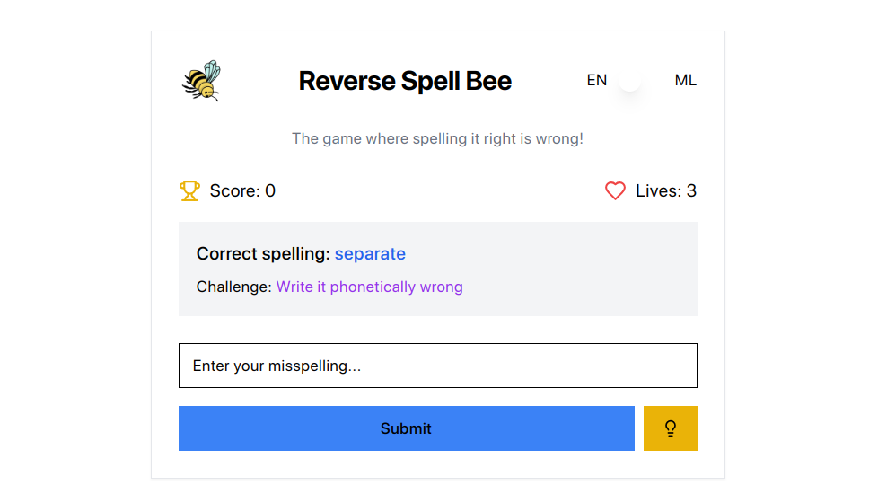
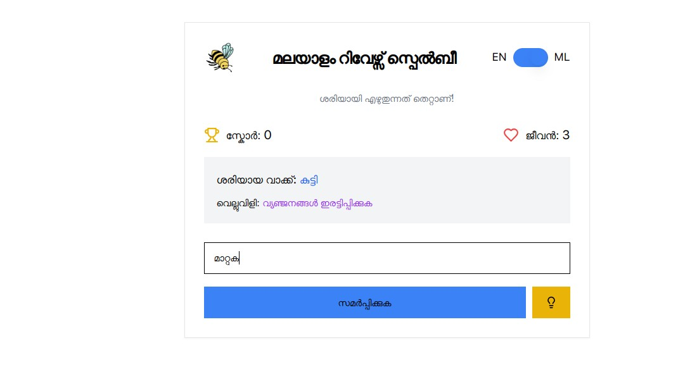
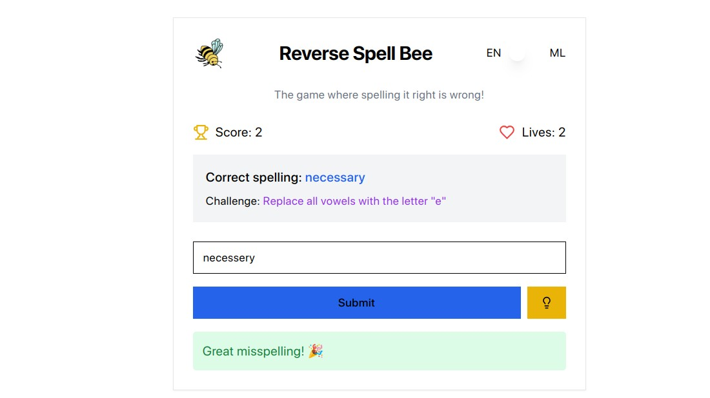
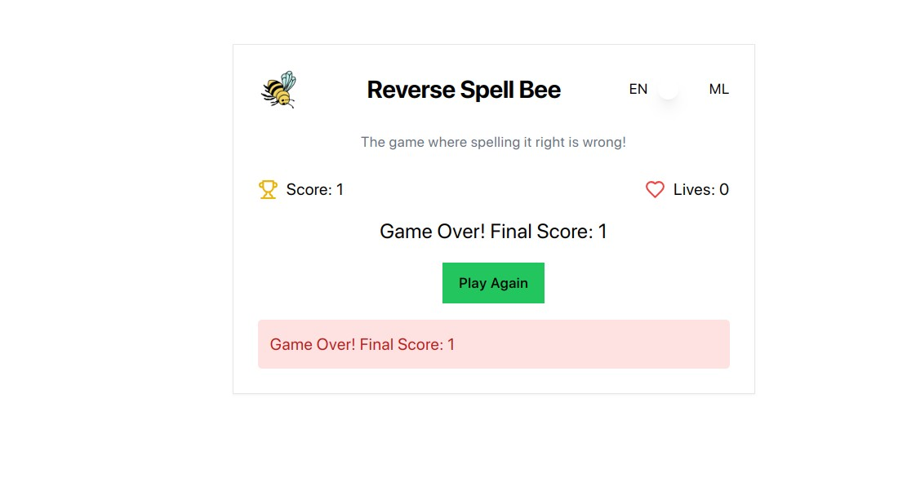

# MultiLingual Reverse SpellBee 🐝


## Basic Details
### Team Name: Vivek's Team


### Team Members
- Team Lead: Vivek K J - Sahrdaya College of Engineering and Technology (Autonomous), Kodakara

### Project Description
Reverse SpellBee is a bizarro-world spelling game where the goal is to deliberately misspell words... but not too badly! Available in both English and Malayalam, it turns the traditional concept of a spelling bee on its head by rewarding creative mistakes while maintaining some similarity to the original word.

### The Problem (that doesn't exist)
In today's world, autocorrect and spell-checkers have made it nearly impossible for people to exercise their creative misspelling muscles. Students are tragically losing the art of making high-quality spelling mistakes, and their "typo creativity" is being stifled by red squiggly lines. Furthermore, there's a severe shortage of games that encourage people to spell things wrong on purpose.

### The Solution (that nobody asked for)
Enter Reverse SpellBee, the revolutionary game that:

- Awards points for deliberately misspelling words, but only if you maintain a certain "similarity threshold" (0.4) to the original word. It's like learning to spell backwards!
- Provides specific "misspelling challenges" like "Replace all vowels with the letter 'e'" or "Double every consonant" to guide your creative destruction of words
- Features a three-heart life system because apparently spelling things correctly is deadly in this universe
- Includes a hint system (because sometimes you need help spelling things wrong)
- Supports both English and Malayalam, because why limit bad spelling to just one language?
- Has a similarity checker to ensure your misspellings aren't TOO creative - you need to maintain at least 40% similarity to the original word. It's like having a spell-checker that checks if you're spelling things wrong the right way!

The game manages to turn a fundamental educational concept completely upside down while somehow still requiring players to understand spelling rules... just so they can break them properly. It's essentially teaching spelling by encouraging players to explore all the ways a word can be wrong, which is either brilliant or completely bonkers - possibly both! 😄
## Technical Details
### Technologies/Components Used
For Software:
- Languages Used
  - Typescript
  - HTML, CSS, JS
- Libraries used
  - React
  - Vite
  - shadcn
  - Tailwind
- Tools used
  - VS Code
  - AI Tools (Claude and GPT)

# Installation

1. Clone the Repository

```
git clone https://github.com/vivekkj123/useless-project
```

1. Clone the Repository

```
git clone https://github.com/vivekkj123/useless-project
```

2. Install Dependencies

```
npm i
```

3. Start the Development Server

```
npm run dev
```
Visit http://localhost:5173 to see the development preview.


# Screenshots (Add at least 3)

*Home Screen of Reverse Spelling Bee(English)*


*Home Screen of Reverse Spelling Bee(Malayalam)*


*Example for a correct (Wrong) Answer*


*Game Over Page*


### Project Demo
# Video
[Demo](https://youtu.be/O20yBC2WkdU)

---
Made with ❤️ at TinkerHub Useless Projects 


